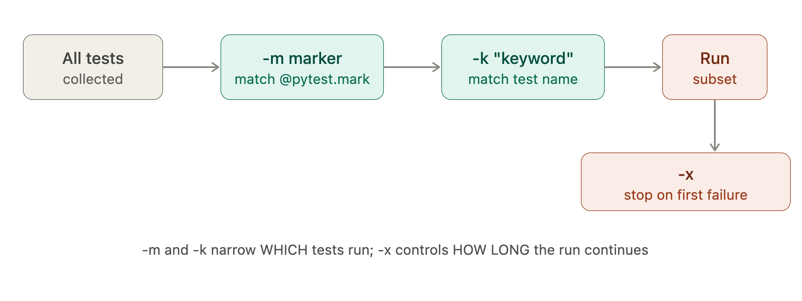

# 🧪 Week 1, Day 4 — Running Tests Selectively

### What it is and why it exists

As a test suite grows from 20 tests to 2,000, running the *entire* suite on every save becomes too slow for a tight feedback loop, and running the entire suite on every CI push becomes too slow for fast merges. "Running tests selectively" is the set of pytest flags that let you run a *subset* of your suite — by name, by category, or by failure behavior — without touching your test code.

This matters because in a real codebase, tests naturally fall into different cost/purpose buckets: fast unit tests you want on every keystroke, slow integration tests you only want before a merge, and flaky/expensive tests you want to quarantine. Selective running is the mechanism that makes that split usable day-to-day.

### Key concepts

Your `pytest.ini` already defines this scaffolding:
```ini
markers =
    slow: marks tests as slow (use --slow to run)
    integration: marks tests requiring external services
    unit: fast unit tests with no I/O
```

- **`-k "expression"`** — substring/keyword match against test **names** (not marks). Supports `and`, `or`, `not`. E.g. `pytest -k "withdraw and not negative"`.
- **`-m marker`** — run only tests decorated with `@pytest.mark.<marker>`. E.g. `pytest -m "unit"`, or combine: `pytest -m "unit and not slow"`.
- **`-x`** — stop after the first failure. Essential when a foundational test failing makes 50 downstream failures noise, not signal.
- **`--tb=short|long|no|line`** — controls how much traceback pytest prints per failure. `short` is the daily driver; `no` is for when you just want the pass/fail count; `long` is for genuinely confusing failures.
- **`-s`** — disables output capturing, so `print()` statements show up live. Normally pytest swallows stdout unless a test fails.
- Markers must be **registered** in `pytest.ini` (as yours are) or pytest emits a warning — this is a real thing interviewers ask about, because unregistered markers silently fail in strict mode (`--strict-markers`).

### Real-world production example

A CI pipeline commonly splits into stages:
```bash
# Stage 1 — every PR, must be under 30s
pytest -m "unit" -x --tb=short

# Stage 2 — every PR, allowed to take longer
pytest -m "not slow" --tb=short

# Stage 3 — nightly only, hits real DB/external APIs
pytest -m "integration"
```
This is exactly the Jenkins/GitHub Actions "environment promotion" pattern you covered in your DevOps course — fast checks gate the merge, expensive checks gate the deploy.

### Two most common beginner mistakes

1. **Confusing `-k` and `-m`.** `-k` matches on the test's *name string* (fuzzy, no registration needed). `-m` matches on *marker decorators* (must be registered, exact match). Beginners try `pytest -k "slow"` expecting it to catch `@pytest.mark.slow` tests — it won't, unless "slow" also happens to be in the function name.
2. **Using `-x` in CI and missing real failures.** `-x` is great locally for a tight edit-debug loop, but in CI it hides how many tests are actually broken — one failure stops the whole run, so you never see if there are 1 or 50. Seniors use `-x` locally, `--maxfail=N` or no limit in CI.

